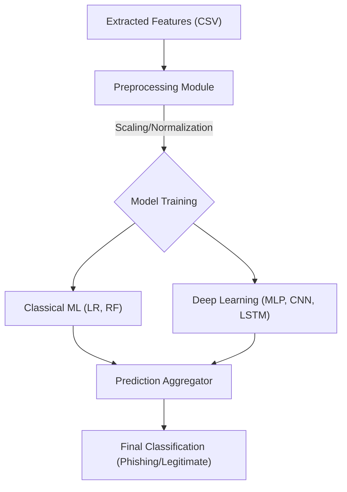
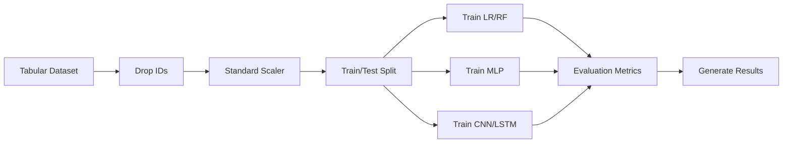

# Phishing Detection System


## 📌 Project Overview
This project implements a comprehensive **Phishing Detection System** using a multi-paradigm approach. We benchmark **Classical Machine Learning**, **Deep Learning**, and **Transformer-based** architectures on a feature-rich tabular dataset. The goal is to identify malicious URLs with high precision and low latency.

The system is designed to be modular, allowing for easy experimentation with different model architectures and preprocessing techniques.

## 🏗️ System Architecture

The following diagram illustrates the high-level data flow within the system:



## ⚙️ Methodology

### 1. Data Preprocessing
Before training, the raw data undergoes a rigorous cleaning and transformation process:
- **Cleaning**: Non-predictive columns such as unique identifiers (`id`) are removed to prevent data leakage.
- **Imputation**: Missing values are handled using a mean imputation strategy to maintain data integrity.
- **Scaling**: We apply `StandardScaler` to normalize numerical features. This is crucial for Deep Learning models (MLP, CNN, LSTM) to ensure stable and fast convergence during gradient descent.
- **Splitting**: The dataset is split into 80% training and 20% testing sets to evaluate model generalization.

### 2. Model Architectures
We explore a diverse set of algorithms to capture different aspects of the data:

#### Classical Machine Learning
- **Logistic Regression**: Serves as a linear baseline to establish minimum performance expectations.
- **Random Forest**: An ensemble method that builds multiple decision trees. It is particularly effective at capturing non-linear interactions between features and providing feature importance insights.

#### Deep Learning
- **MLP (Multi-Layer Perceptron)**: A fully connected dense network with Dropout layers to prevent overfitting. It learns complex non-linear mappings from the feature space to the target class.
- **1D CNN (Convolutional Neural Network)**: Traditionally used for time-series or image data, we apply 1D convolutions across the feature vector. This allows the model to detect local patterns and correlations between adjacent features.
- **LSTM (Long Short-Term Memory)**: Treats the feature vector as a sequence. This architecture is tested to see if there are sequential dependencies or "grammar-like" structures in the feature arrangement.

#### Transformer
- **Tabular Transformer**: Utilizes a **Multi-Head Self-Attention** mechanism. Unlike the LSTM which processes sequentially, the Transformer weighs the importance of all features simultaneously, allowing the model to focus on the most critical indicators of phishing regardless of their position in the input vector.

## 🔄 Training Pipeline

The training process is automated and follows this workflow:



## 📊 Dataset Statistics
The dataset consists of extracted features from URLs.

| Metric | Description |
| :--- | :--- |
| **Input Type** | Tabular (Numerical Features) |
| **Features** | URL Length, Special Char Counts, Domain Age, etc. |
| **Classes** | Binary (0: Legitimate, 1: Phishing) |
| **Split** | 80% Training, 20% Testing |

## 🧠 Models Implemented

| Model Type | Architecture | Description |
| :--- | :--- | :--- |
| **Classical ML** | **Logistic Regression** | Baseline linear classifier. |
| **Classical ML** | **Random Forest** | Ensemble of decision trees for robust feature importance. |
| **Deep Learning** | **MLP (Dense)** | Multi-Layer Perceptron with Dropout. |
| **Deep Learning** | **CNN (1D)** | Convolutional Neural Network for local feature pattern extraction. |
| **Deep Learning** | **LSTM** | Long Short-Term Memory network treating features as a sequence. |
| **Transformer** | **Tabular Transformer** | Self-Attention mechanism applied to feature vectors. |

## 🚀 Setup & Installation

1.  **Clone the Repository**
    ```bash
    git clone <repository_url>
    cd Phising Detection
    ```

2.  **Install Dependencies**
    ```bash
    pip install -r requirements.txt
    ```

3.  **Prepare Data**
    - Place your `dataset.csv` in the `data/` directory.

## 🏃 Usage

### Training
Run the main training script to train all models and generate a results summary.

```bash
python src/train.py --epochs 20 --batch_size 32
```

### Arguments
| Argument | Default | Description |
| :--- | :--- | :--- |
| `--epochs` | 10 | Number of training epochs for DL models. |
| `--batch_size` | 32 | Batch size for training. |

## 📂 Directory Structure

```plaintext
Phising Detection/
├── data/               # Dataset storage
├── docs/               # Documentation & Reports
├── notebooks/          # Exploratory Data Analysis
├── src/                # Source Code
│   ├── models.py       # Model architectures (ML, DL, Transformer)
│   ├── preprocessing.py# Data cleaning & scaling pipeline
│   └── train.py        # Main training entry point
├── LICENSE             # MIT License
├── README.md           # Project Documentation
└── requirements.txt    # Python Dependencies
```

## 📜 License
This project is licensed under the **MIT License**. See the [LICENSE](LICENSE) file for details.
