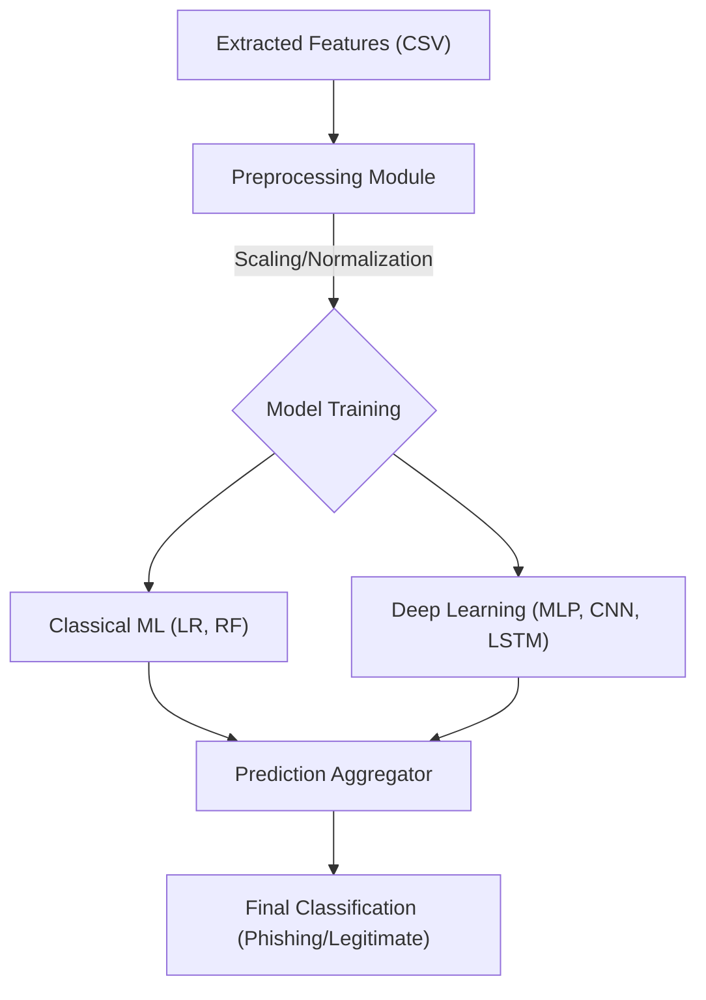
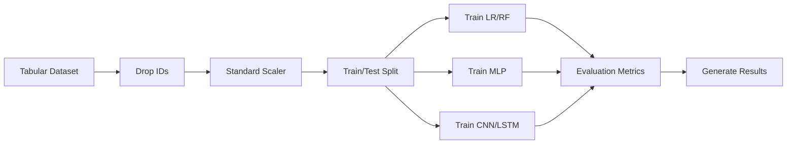

# System Architecture & Flowcharts

## High-Level Architecture

```mermaid
graph TD
    A["Extracted Features (CSV)"] --> B["Preprocessing Module"]
    B -->|Scaling/Normalization| C{"Model Training"}
    C --> D["Classical ML (LR, RF)"]
    C --> E["Deep Learning (MLP, CNN, LSTM)"]
    
    D --> F["Prediction Aggregator"]
    E --> F
    
    F --> G["Final Classification (Phishing/Legitimate)"]
```

## Training Pipeline Flowchart

```mermaid
flowchart LR
    Data[Tabular Dataset] --> Clean[Drop IDs]
    Clean --> Scale[Standard Scaler]
    Scale --> Split[Train/Test Split]
    
    Split --> M1[Train LR/RF]
    Split --> M2[Train MLP]
    Split --> M3[Train CNN/LSTM]
    
    M1 --> Eval[Evaluation Metrics]
    M2 --> Eval
    M3 --> Eval
    
    Eval --> Report[Generate Results]
```
